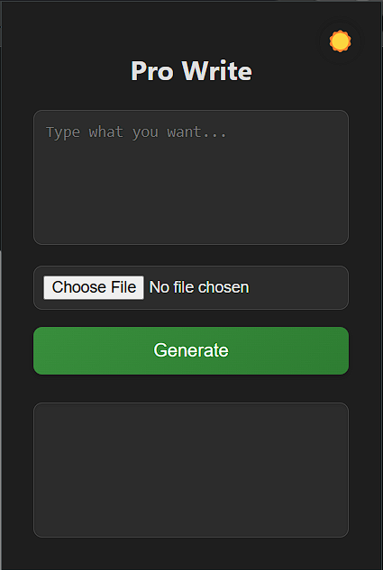
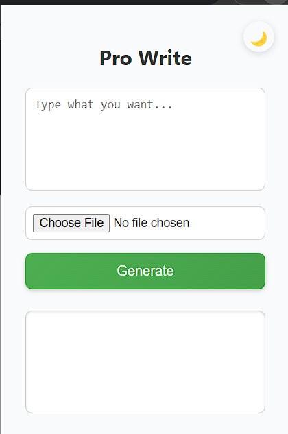

# ✍️ ProWrite — Smart Professional Writer Chrome Extension

<p align="center">
  
</p>

> **ProWrite** helps you transform rough drafts into professional messages for LinkedIn, referrals, referral and more — powered by the **Gemini API**.

---

## 🚀 Features

- **📝 User Input Friendly** — Type your rough message or upload a file.
- **📄 Resume Integration** — Enriches prompts with resume data (optional).
- **🎯 Smart Prompting** — Combines your input and resume intelligently.
- **🔄 Flexible Handling** — Works even if no resume is uploaded.
- **⚡ Instant Output** — Get polished, formal content instantly.

---

## 🏩 File Structure

### Frontend (Chrome Extension)

```plaintext
chrome-extension/
├── manifest.json
├── popup.html
├── popup.js
├── style.css
├── img/
    ├── icon16.png
    ├── icon48.png
    └── icon128.png

```

- **manifest.json** – Extension metadata (permissions, background scripts, popup page).
- **popup.html / popup.css** – Main UI and logic.
- **popup.js** – Handles background operations like API calling and userId.
- **icons/** – Extension logos and images.

---
```
backend/
├── src/
│ ├── main/
│ │ ├── java/com/prowrite/
│ │ │ ├── controller/FormalController.java
│ │ │ ├── model/Resume.java
│ │ │ ├── repository/ResumeRepository.java
│ │ │ ├── service/FormalService.java
│ │ │ └── BackendApplication.java
│ │ └── resources/
│ │ ├── application.properties
│ │ └── static/
│ └── test/
└── pom.xml

```

- **controller/** – Handles incoming HTTP requests (userId,metaData,resumeFile).
- **service/** – Business logic for processing text (process data and create prompts and call Api).
- **resources/** – Configuration and static files.
- **pom.xml** – Maven build configuration.

```

```

Flowchart
    A[User Input Text + Resume Upload (Optional)] --> B[Chrome Extension (popup.js generates userId)]
    B --> C[POST Request to Backend API]
    C --> D[Spring Boot Controller]
    D --> E[Service Layer: Process & Enhance Text]
    E --> F[Generate Polished Output]
    F --> G[Return to Chrome Extension UI]


```

**Request Body Example:**

```json
{
  "userId": "abc123",
  "metaData": "I want to apply for a job at XYZ company.",
  "resumeFile": "abc.pdf"  (Optional)
}
```

**Working:**

- **userId** is used to associate the generation with a user (future tracking feature).
- **metaData** is mandatory.
- **resumeFile** upload is optional to personalize the generation using resume content.

---

## 🛠️ How to Setup and Run

### 1. Clone the Repository

```bash
git clone https://github.com/your-username/ProWrite.git
cd ProWrite
```

---

### 2. Setup Backend

- Navigate to `/backend`
- Open in your favorite IDE (like IntelliJ or VS Code)
- Run:

```bash
./mvnw spring-boot:run
```

Backend will start at `http://localhost:8085`.

---

### 3. Setup Chrome Extension (Frontend)

- Go to `chrome://extensions/`
- Enable **Developer Mode**
- Click **Load unpacked** and select the `frontend` folder.
- Extension will now be active! 🎉

---

## 📸 Screenshots

### 🌟 Extension Popup (Light Mode)



---

### 🌙 Extension Popup (Dark Mode)



---

# ✨ Future Plans

- 🔹 Support of Highlighted Text Generation
- 🔹 Increase Response Time
- 🔹 Upload and Manage Multiple Files

---

# 💻Tech Satck

### 🛠️ Backend

<p align="left">     </p>

### 🎨 Frontend

<p align="left">     </p>

### 🔗 API

<p align="left">   </p>

---
